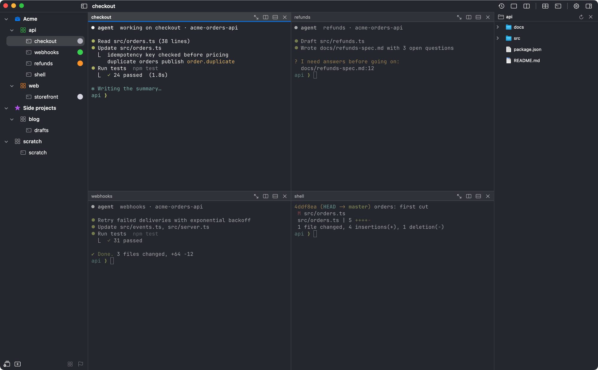
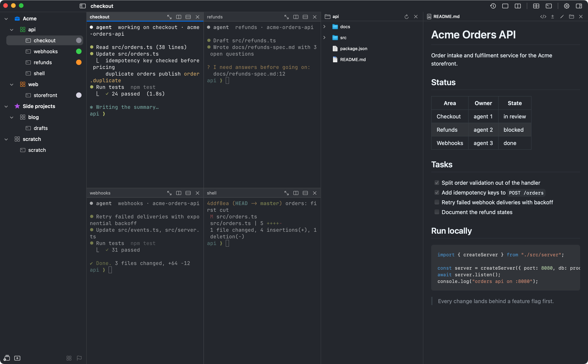
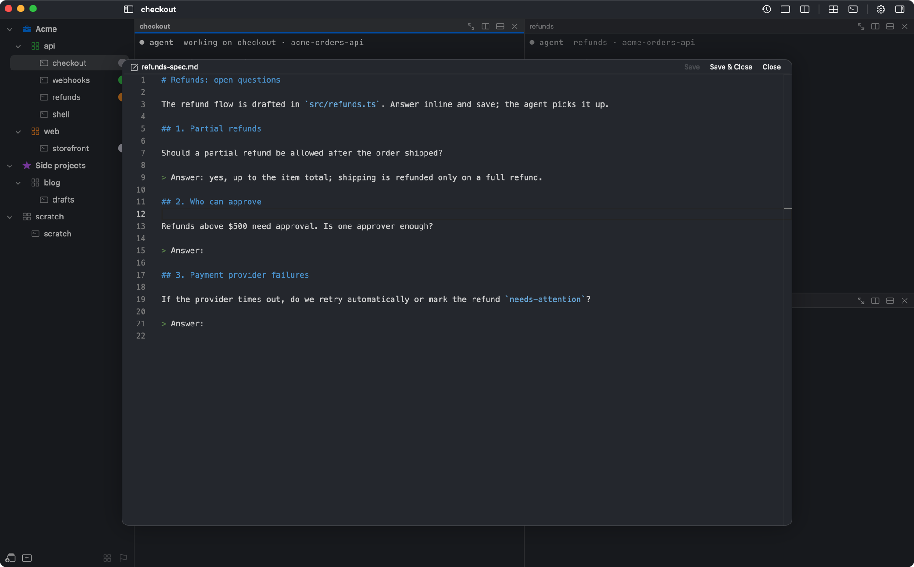
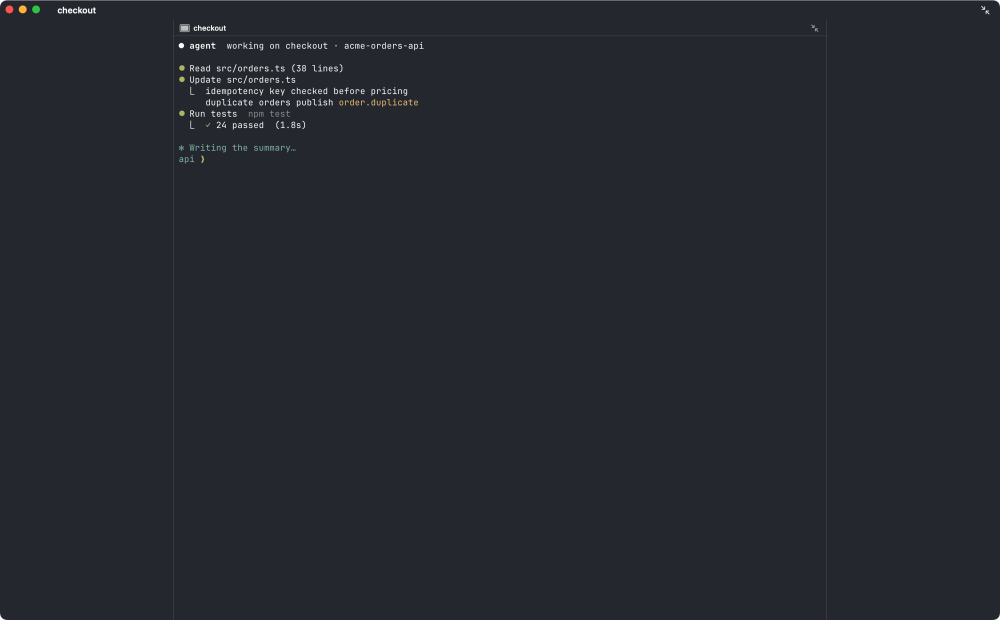
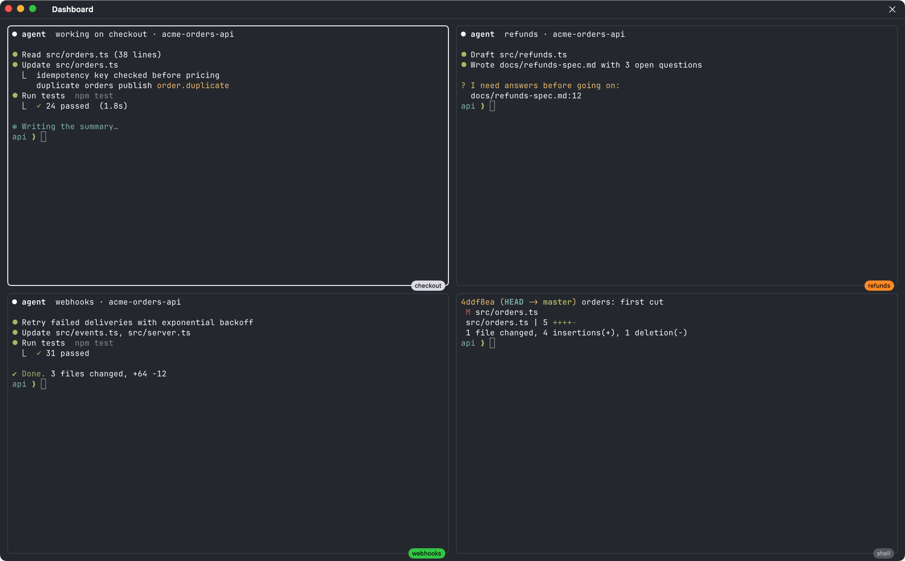

# VolkTerm - a terminal for running many coding agents at once

VolkTerm is a native macOS terminal built on [Ghostty](https://ghostty.org)'s engine, for working with several coding
agents at once: a workspace is a screen of terminal tiles, workspaces sit in groups, a file tree and a VS Code editor
live beside the tiles, every agent comes back after a reboot exactly as it was started, and a phone app keeps you in
the conversation away from the desk. It is a fork of [agterm](https://github.com/umputun/agterm) by
[Umputun](https://github.com/umputun) and keeps its full control API: almost everything is scriptable through the
`volktermctl` CLI.

This repository holds the releases, the documentation and the issue tracker; the source is kept separately.


<details>
<summary>Screenshots</summary>

Workspace groups in the sidebar, four agents tiled in one workspace, the file tree:



The file tree and a Markdown preview beside the tiles:



An agent's spec with open questions, opened from a ⌘-click on its path, answered in place:



One tile maximized as a reading column, the others out of sight:



The dashboard: every agent's live output at once, colored by status:



</details>

## Install

Releases run on **Apple Silicon and Intel Macs with macOS 14 or later**.

Homebrew:

```sh
brew tap baffolobill/tap
brew trust baffolobill/tap      # Homebrew loads third-party taps only once trusted
brew install --cask volkterm
```

The cask also puts `volktermctl` on your `PATH`.

Direct download: take the latest `.dmg` from [Releases](https://github.com/baffolobill/volkterm/releases), open it and
drag `volkterm.app` into `/Applications`. Releases are not notarized by Apple yet, so a downloaded copy is blocked on
first launch. Clear the download flag once:

```sh
xattr -dr com.apple.quarantine /Applications/volkterm.app
```

or open it from **System Settings ▸ Privacy & Security ▸ Open Anyway**. Homebrew clears the flag itself. Then put the
CLI on your `PATH` with **Help ▸ Install Command Line Tool…**; the same menu installs the agent status hooks and the
agent skill.

**Updates.** VolkTerm checks this repository once a day; when a newer release is out, an arrow appears in the title
bar, and **Update** installs it in the background (through Homebrew for a cask install, from the release otherwise)
and offers to restart. Live sessions keep running through the restart.

## What it does

**Tiles and workspaces**

- **Tiled workspaces.** A workspace is one screen and each of its sessions a tile, as in VS Code: split right or down
  from the tile header (⌘D, ⇧⌘D), drag a divider to resize, ⌥⌘ + arrows to move between tiles, and drag a tile by its
  header beside another or onto it to swap. The sidebar lists sessions in screen order.
- **Workspace groups** with colors and icons, a flagged working set, a focus filter, and recency switching (Ctrl-Tab).
- **Several windows**, one per screen if you like, restored where they were; a session, workspace or group moves to
  another window, still running.
- **Reading width.** A maximized tile, and a workspace's only tile, are centered as a reading column.
- **New-workspace wizard (⇧⌘N).** A folder and a number of tiles, some running Claude, Codex or another agent.

**Agents**

- **Agent status** on every row and tile (working, waiting for you, done) for Claude Code, Codex, Pi, OpenCode and
  others, with the model, context use and the agent command it runs as in the tile header.
- **Agent commands** (Settings ▸ Agents): named command lines such as `ANTHROPIC_AUTH_TOKEN=… claude` for each
  subscription, started from the tile menu, with an optional proxy per command.
- **Continue as** another subscription when one runs out, and **auto-continue** after a lost connection, an
  overloaded API or a spent limit.
- **Subscription limits** at the bottom of the sidebar, with notifications at 80% and when a window runs out.
- **Notifications** when an agent finishes or stops on an error, all kept in the bell at the bottom of the sidebar.
- **Ask About Selection (⇧⌘A)** quotes selected text into the agent's prompt; a side agent answers questions about a
  file you are reading.
- **Agent updates.** VolkTerm ▸ Update Claude Code… and Update Codex… update them the way they were installed and
  restart their sessions, each resuming its conversation.

**Files**

- **File tree** beside the tiles, following the focused tile's directory.
- **Preview and edit** any file: Markdown rendered like GitHub, code in the VS Code editor with a diff against the last
  commit. ⌘-click a path an agent prints to open it in an editor popup and answer in place.

**Restore**

- **Agents come back after a reboot.** In Live sessions mode each pane's command line is replayed exactly as typed,
  with the agent's conversation resumed. Plain shells come back in their directory with their last screen.
- **Checkpoints** of every window, workspace and session, exportable to another Mac.

**Phone**

- **VolkTerm Remote** for iPhone, iPad and Android: your sessions as chats, answered by text or voice, with the
  agent's screen for its menus and slash commands, file links, splits, subscription limits and notifications. It
  connects peer-to-peer (VolkTerm ▸ Pair Phone…), to several Macs at once.

**Everything else**

- **Plugins** add menu items, title-bar buttons and a sidebar widget from a folder of HTML and a manifest.
- **Proxies** for VolkTerm's own connections and new shells, and per agent command.
- **Interface** in English, Russian, German and Simplified Chinese.
- **Themes**: 512 bundled, iTerm2 and Ghostty theme import, translucency, per-session backgrounds and watermarks.
- **Keymap and hooks**: rebind every action, bind shell lines to chords, run scripts on events.
- **Remote sessions**: attach a live session running on another Mac over SSH.

## Scripting volkterm

`volktermctl` talks to the running app over a local socket, and every state it sets reads back in `tree`:

```sh
ws=$(volktermctl workspace new demo)                          # capture the new workspace's id
sid=$(volktermctl session new --workspace "$ws" --cwd "$PWD" --no-select)
volktermctl tile split right --target "$sid"                  # a second tile beside it
volktermctl session type $'pwd\n' --target "$sid"             # drive a session you are not looking at
volktermctl session text --target "$sid" --lines 10           # read its terminal back
volktermctl edit docs/spec.md:12                              # hand the user a file to answer in
volktermctl tree --json                                       # dump the whole model as JSON
```

The agent skill (Help ▸ Install Agent Skill…) teaches Claude Code and Codex the same API, so an agent can build its
own layout, show you a report in an overlay or ask you a question in a dialog.

## Documentation

- [Command reference](docs/commands.md): every `volktermctl` command, its arguments and what it reads back.
- [FAQ](docs/faq.md): windows, restarts and Live sessions, updates, agents, the phone app, the license.

## Issues

Found a bug or want something? [Open an issue](https://github.com/baffolobill/volkterm/issues/new/choose). For a bug,
the VolkTerm version (VolkTerm ▸ About), your macOS version and the steps that show it help most.

## Credits

- **[agterm](https://github.com/umputun/agterm)** by [Umputun](https://github.com/umputun) and its contributors is the
  base of everything here.
- **[Rook](https://github.com/jokius/rook)** by [@jokius](https://github.com/jokius) and
  **[aohoyd/agterm](https://github.com/aohoyd/agterm)** by [@aohoyd](https://github.com/aohoyd): the file tree, the
  first Markdown preview, and workspace and session colors came from these forks.
- **[Ghostty](https://github.com/ghostty-org/ghostty)** (MIT) provides libghostty, which does the real terminal work.
- **[Monaco Editor](https://github.com/microsoft/monaco-editor)**, **[markdown-it](https://github.com/markdown-it/markdown-it)**
  and **[github-markdown-css](https://github.com/sindresorhus/github-markdown-css)** (MIT) power the file preview.

## License

MIT, as agterm. See [LICENSE](LICENSE).
